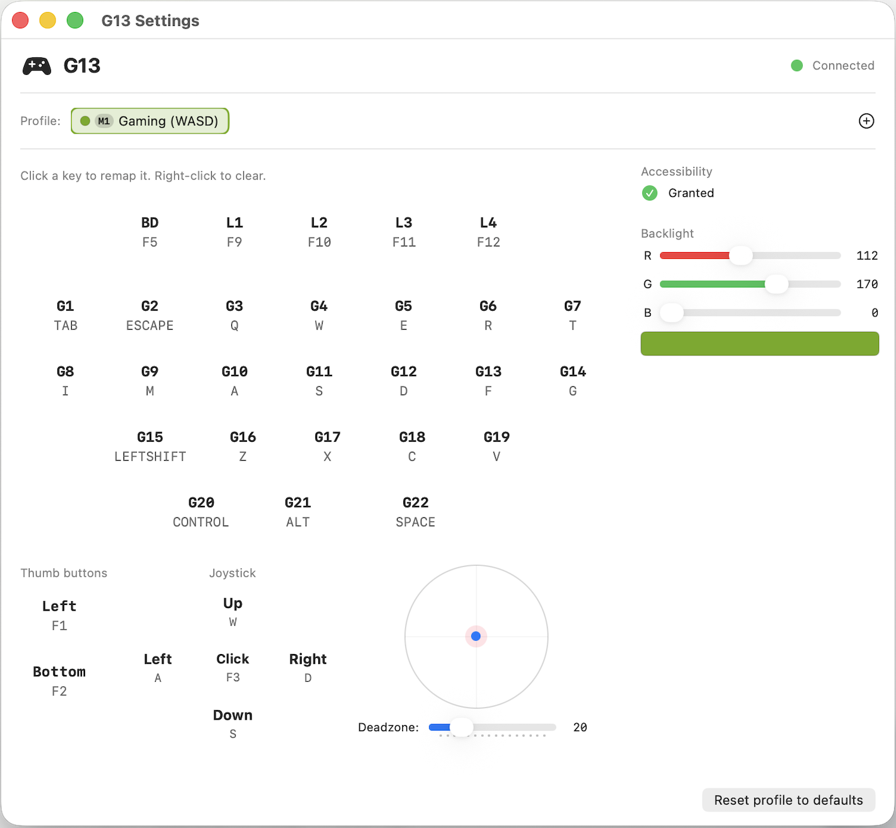

# G13

A native macOS menu bar app for the **Logitech G13 Advanced Gameboard**.

Since Logitech has discontinued support for the G13, there is no official driver for modern macOS. G13 fills that gap — it's a lightweight, open-source Swift app that gives you full control of your G13 directly from the menu bar.


## Features

- **Key remapping** — Map any of the 22 G-keys, thumb buttons, joystick click, and LCD buttons to any keyboard key or combination (Cmd+C, Ctrl+Shift+S, etc.)
- **Joystick as keys** — Configure joystick directions to send keyboard inputs (WASD by default), with adjustable deadzone
- **Multiple profiles** — Create profiles for different games or applications, switch instantly with M1/M2/M3 buttons
- **RGB backlight control** — Set any color for the key and LCD backlight, saved per profile
- **LCD display** — Shows the active profile name on the 160×43 monochrome screen
- **M-key LEDs** — Automatically lights the LED matching the active profile
- **Auto-reconnect** — Plug/unplug freely, the app reconnects automatically
- **Menu bar app** — Lives in the menu bar, no Dock icon, minimal footprint
- **Native macOS** — Pure Swift + IOKit + SwiftUI, no external dependencies

## Screenshot



## Requirements

- macOS 14.0 (Sonoma) or later
- Logitech G13 Advanced Gameboard
- Accessibility permission (required for key injection)

## Installation

### Pre-built release

1. Download `G13-v1.1.0-macos.zip` from the [Releases](https://github.com/golgote/G13/releases) page
2. Unzip and drag `G13.app` to your Applications folder

> **Note:** The app is not notarized. On first launch, macOS Gatekeeper will block it with a message saying the developer cannot be verified. To open it anyway:
>
> - **Option A** — Right-click (or Ctrl+click) `G13.app` → **Open** → **Open** in the confirmation dialog
> - **Option B** — After the blocked launch attempt, go to **System Settings → Privacy & Security**, scroll down and click **Open Anyway** next to the G13 message

You only need to do this once. Subsequent launches will work normally.

### From source (Xcode)

1. Clone the repository:
   ```
   git clone https://github.com/golgote/G13.git
   ```
2. Open `G13.xcodeproj` in Xcode
3. Build and run (Cmd+R)
4. Grant Accessibility permission when prompted (System Settings → Privacy & Security → Accessibility)

## Usage

### First launch

1. Plug in your G13
2. Launch the app — a gamepad icon appears in the menu bar
3. Grant Accessibility permission when prompted
4. The G13 backlight turns on and the default WASD gaming profile is loaded

### Remapping keys

1. Click the menu bar icon → **Settings...**
2. Click any G-key button in the settings window
3. Press the key (or key combination) you want to assign
4. The mapping is saved automatically

To clear a mapping, right-click a key and select "Clear mapping".

### Profiles

- **M1/M2/M3** buttons on the G13 switch between the first 3 profiles
- Create new profiles with the **+** button in the settings window
- Right-click a profile tab to rename, duplicate, or delete it
- Each profile stores its own key mapping, joystick config, and backlight color

### Joystick

The joystick sends configurable key presses for each direction (default: WASD). Click a direction in the joystick section of settings, then press the desired key.

Adjust the deadzone slider to control how far you need to push the stick before it registers.

## How it works

G13 communicates directly with the Logitech G13 hardware over USB HID using Apple's IOKit framework:

- **IOHIDManager** detects the device (Vendor ID `0x046D`, Product ID `0xC21C`) and monitors for plug/unplug events
- **Input reports** (8 bytes) are decoded to identify key presses and joystick position
- **Output reports** (992 bytes) send framebuffer data to the 160×43 LCD
- **Feature reports** control the RGB backlight (Report ID `0x07`) and M-key LEDs (Report ID `0x05`)
- **CGEvent** (CoreGraphics) injects keyboard events into macOS, requiring Accessibility permission

No kernel extensions, no third-party libraries, no elevated privileges.

## USB Protocol Reference

The G13 communicates via USB Full Speed (12 Mb/s):

| Direction | Endpoint | Size | Content |
|-----------|----------|------|---------|
| IN | 1 | 8 bytes | Key state + joystick position |
| OUT | 2 | 992 bytes | LCD framebuffer (32 header + 960 image) |

**Input report format:**
```
[0] Always 0x01
[1] Joystick X (0-255, ~127 at center)
[2] Joystick Y (0-255, ~127 at center)
[3] Keys: G1-G8 (bit 0 = G1)
[4] Keys: G9-G16
[5] Keys: G17-G22, light state
[6] Keys: BD, L1-L4, M1-M3
[7] Keys: MR, LEFT, RIGHT, STICK, light controls
```

## Project structure

```
G13/
├── G13App.swift                 — App entry point (menu bar)
├── G13Device.swift              — USB/HID communication, auto-reconnect
├── G13LCD.swift                 — LCD framebuffer + 5×7 bitmap font
├── KeyMapper.swift              — Key remapping + CGEvent injection
├── ProfileManager.swift         — Multi-profile preferences (UserDefaults)
├── ContentView.swift            — Settings window (SwiftUI)
├── MenuBarView.swift            — Menu bar drop-down
└── SettingsWindowController.swift — AppKit window management
```

## Acknowledgments

This project was inspired by and references the USB protocol work from:

- [tewhalen/g13slop](https://github.com/tewhalen/g13slop) — Python G13 driver for macOS
- [ecraven/g13](https://github.com/ecraven/g13) — C++ libusb driver for Linux
- [bjanders/g13](https://github.com/bjanders/g13) — Go library with protocol documentation
- [jtgans/g13gui](https://github.com/jtgans/g13gui) — Python GUI driver for Linux

## Contributing

Contributions are welcome! Feel free to open issues or pull requests.

1. Fork the repository
2. Create your feature branch (`git checkout -b feature/my-feature`)
3. Commit your changes (`git commit -am 'Add my feature'`)
4. Push to the branch (`git push origin feature/my-feature`)
5. Open a Pull Request

## License

MIT License — see [LICENSE](LICENSE) for details.

Copyright (c) 2026 Bertrand Mansion
